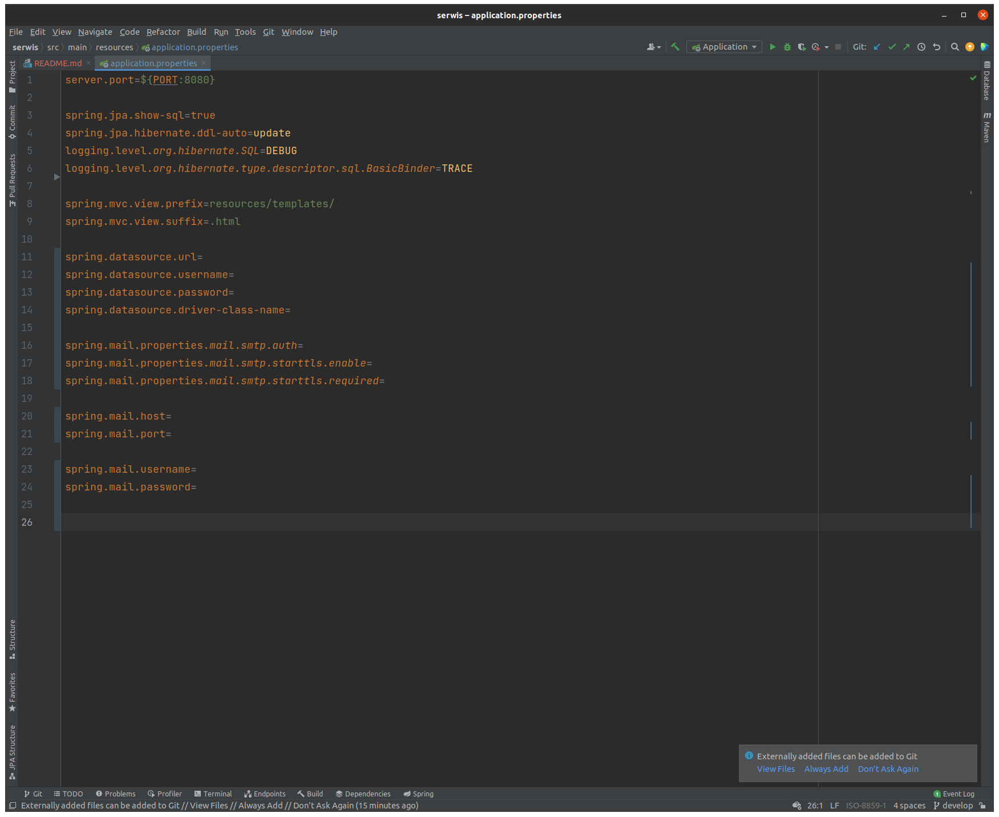

# Service Devices

## Table of Contents
* [General Info](#general-information)
* [Technologies Used](#technologies-used)
* [Screenshots](#screenshots)
* [Setup](#setup)
* [Usage](#usage)
* [Project Status](#project-status)
* [Room for Improvement](#room-for-improvement)

## General Information
> The project was created at the end of the Coderslab programming course.
> This project is a summary of my skills which I acquired during 2 months of study.
> The application is a manager to manage inspections and repairs that can be found in stores.

## Technologies Used
- Spring Framework
- Hibernate
- Java
- BootStrap
- Css
- Thymeleaf

## Screenshots

## Setup
- you need to set up the email client configuration
- set the database configuration, all configurations should be done in the "application.properties" file

## Project Status
The project is on hold, but I plan to develop this project in my spare time.

## Room for Improvement
- add an addition for clients so that I can melt down broken joins

